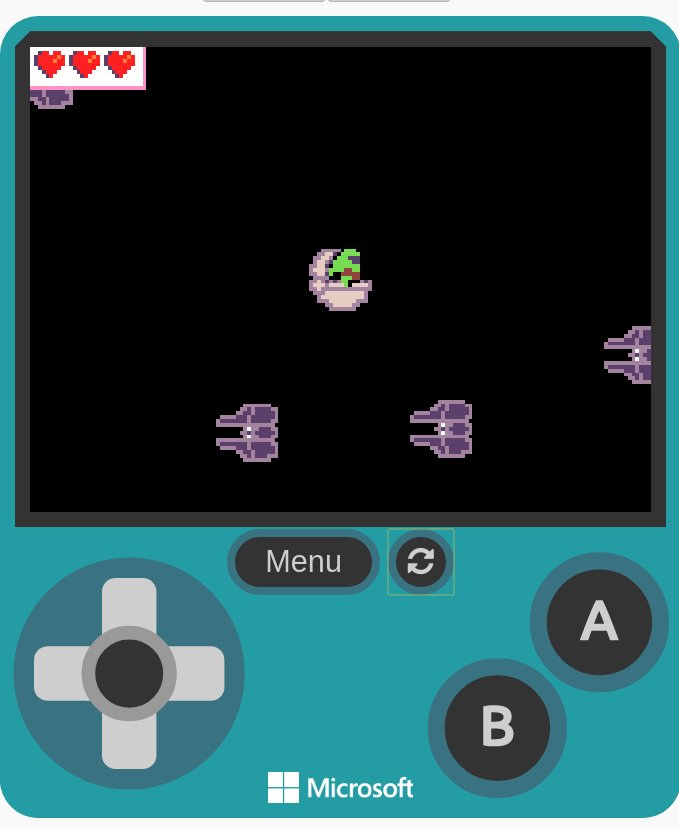

# baby-yoda-vs-tie-fighters 

## Use this extension

This repository can be added as an **extension** in MakeCode.

* open https://arcade.makecode.com/
* click on **New Project**
* click on **Extensions** under the gearwheel menu
* search for the URL of this repository and import

## Game preview
* open https://arcade.makecode.com/55093-39184-45354-26470

## Supported targets

* for PXT/arcade
* for PXT/arcade
(The metadata above is needed for package search.)

